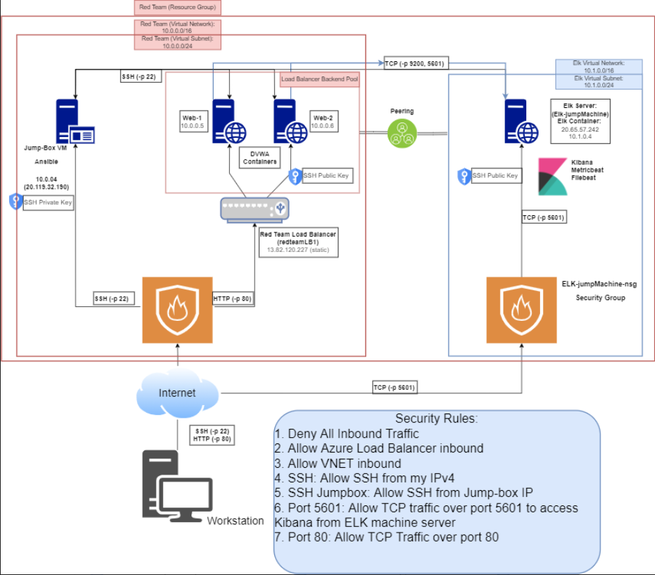

## Automated ELK Stack Deployment

The files in this repository were used to configure the network depicted below.



These files have been tested and used to generate a live ELK deployment on Azure. They can be used to either recreate the entire deployment pictured above. Alternatively, select portions of the yml and config file may be used to install only certain pieces of it, such as Filebeat.

* [Ansible Configuration](./AnsibleConfig.yml)
* [Ansible Initialization Playbook](./InitializationPlaybook.yml)
* [Hosts_file](./HostsFile.yml)
* [ELK Installation](./ELKInstallation.yml)
* [Filebeat Configuration](./FilebeatConfig.yml)
* [Filebeat Playbook](./FilebeatPlaybook.yml)
* [Metricbeat Configuration](./MetricbeatConfig.yml)
* [Metricbeat Playbook](./MetricbeatPlaybook.yml)

This document contains the following details:
* Description of the Topology
* Access Policies
* ELK Configuration
  + Beats in Use
  + Machines Being Monitored
* How to Use the Ansible Build


### Description of the Topology

The main purpose of this network is to expose a load-balanced and monitored instance of DVWA, the Damn Vulnerable Web Application.

Load balancing ensures that the application will be highly functional and available, in addition to restricting traffic to the network.

* What aspect of security do load balancers protect?
	+ **Load balancers protect against high amounts of live traffic on a network by mitigating how much network traffic is sent to a server. Much like a stop light. This helps significantly to counterract network traffic based attacks such as a DDoS**

* What is the advantage of a jump box?
	+ **A jump box acts as a middle man to communicate among other virtual machines on the network while restricting access to the network through a single device. In this way, only the jump box is vulnerable but the jump box also works as a one stop shop for accessing the other machines in the same network.** 

Integrating an ELK server allows users to easily monitor the vulnerable VMs for changes to the Network and system logs.

* What does Filebeat watch for?
	+ **Filebeat monitors specified log files, collects log events, and forwards the information to either Elatiscsearch or Logstash for indexing.**
	
* What does Metricbeat record?
	+ **Metricbeat takes collected metrics and statics and sends them to the output that you specify, such as Elasticsearch or Logstash for further use.**

The configuration details of each machine may be found below.
_Note: Use the [Markdown Table Generator](http://www.tablesgenerator.com/markdown_tables) to add/remove values from the table_.

| Name     | Function   | IP Address           | Operating System |
|----------|------------|----------------------|------------------|
| Jump Box | Gateway    |10.0.0.4/20.119.32.190| Linux            |
| Web-1    |UbuntuServer|10.0.0.5/13.82.120.227| Linux            |
| Web-2    |UbuntuServer|10.0.0.6/13.82.120.227| Linux            |
| ELK-jump |UbuntuServer|10.1.0.4/20.65.57.242 | Linux            |

### Access Policies

The machines on the internal network are not exposed to the public Internet. 

Only the Jump-Box machine can accept connections from the Internet. Access to this machine is only allowed from the following IP addresses:

* **Workstation My Public IP through TCP 5601**

Machines within the network can only be accessed by **Workstation and Jump-Box through SSH Jump-Box.**

* Which machine did you allow to access your ELK VM? 

 + **Jump-Box IP: 20.119.32.190 via SSH port 22** 

* What was its IP address?_

 + **My Workstation using MY Public IP via port TCP 5601**

A summary of the access policies in place can be found in the table below.

| Name     | Publicly Accessible | Allowed IP Addresses |
|----------|---------------------|----------------------------------------------|
| Jump-Box | Yes                 | 20.119.32.190 (Workstation IP on SSH 22      |
|  Web-1   | No                  |   10.0.0.5 on SSH 22                         |
|   Web-2  | No                  |   10.0.0.6 pn SSH 22                         |
| ElkServer| No                  |   Workstation MY Public IP using TCP 5601    |

### Elk Configuration

Ansible was used to automate configuration of the ELK machine. No configuration was performed manually, which is advantageous because...

* What is the main advantage of automating configuration with Ansible?_

 + **Ansible allows you to quickly and easily (if you know YAML) to deploy several multi-tier applications through YAML based playbooks.** 

The playbook implements the following tasks:
* In 3-5 bullets, explain the steps of the ELK installation play. E.g., install Docker; download image; etc._
	+ Specify a group of machines
	```yaml
	- name: Install & Configure ELK with Docker
      hosts: elk
      remote_user: sysadmin
      become: true
      tasks:
	```	
	+ Increase Virtual Memory
	```yaml
	- name: Utilize More Memory
      sysctl:
        name: vm.max_map_count
        value: 262144
        state: present
        reload: yes
	```
	+ Install Docker.io
	```yaml
	- name: Install Docker.io
      apt:
        update_cache: yes
        name: docker.io
        state: present
	```
	+ Install Python-pip
	```yaml
	 name: Install pip3
     apt:
      force_apt_get: yes
      name: python3-pip
      state: present
	```
	+ Install Docker Python Module
	```yaml
	- name: Install Docker Python Module
      pip:
        name: docker
        state: present
	```
	+ Download and Launch Elk Docker Container and make available ports
	```yaml
	 - name: Download and launch ELK container
       docker_container:
         name: ELK
         image: sebp/elk:761
         state: started
         restart_policy: always
         published_ports:
           - 5601:5601
           - 9200:9200
	       - 5044:5044
	```
	+ Enable Docker services to run 
	```yaml
	 - name: Enable my docker services
       systemd:
         name: docker
         enabled: yes
	```
The following screenshot displays the result of running `docker ps -a` after successfully configuring the ELK instance.

**Jump-Box**


**Web-1**


**Web-2**


**ELK-box**


### Target Machines & Beats
This ELK server is configured to monitor the following machines:
* List the IP addresses of the machines you are monitoring_
+ Web-1: 10.0.0.5 
+ Web-2: 10.0.0.6

We have installed the following Beats on these machines:

* Filebeat allows the collection of log files from very specific file collection softwares like Apache, Microsoft Azure tools and webservers.

 + [Filebeat Module Status Screenshot](./Cyber/Pictures/Filebeat-status.png)

* Metricbeat will be used to monitor VM stats, CPU core stats, filesystem stats, memory stats, and network stats.

 + [Metricbeat Module Status Screenshot](./Cyber/Pictures/Metricbeat-status.png)
	+ [Metricbeat Dashboard](./Cyber/Pictures/Metricdash.png)
	+ [Metricbeat CPU Statistics](./Cyber/Pictures/Metriccpu.png)
	+ [Metricbeat Memory Statistics](./Cyber/Pictures/Metricmemory.png)

### Using the Playbook
In order to use the playbook, you will need to have an Ansible control node already configured. Assuming you have such a control node provisioned: 

* Verify the Public IP Address to see if it has changed. [What is My IP?](https://ip.me/)
* If it has changed then update the Security Rules that uses the My Public IPv4

SSH into the control node and follow the steps below:
- Copy the **yml** file to **ansible folder**.
- Update the **config** file to include **remote users and ports**
- Run the playbook, and navigate to **Kibana using: ((Your ELK Machine IP Address):5601)** to check that the installation worked as expected.

Answer the following questions to fill in the blanks:_

* Which file is the playbook? Where do you copy it?_
 + For Ansible create [Initialization Playbook](./InitializationPlaybook.yml)
 + For Filebeat create [Filebeat Playbook](./FilebeatPlaybook.yml)
 + For Metricbeat create [Metricbeat Playbook](./MetricbeatPlaybook.yml) and copy it to...
 + /etc/ansible/

* Which file do you update to make Ansible run the playbook on a specific machine? 
 + /etc/ansible/hosts file (IP of the Virtual Machines)

* How do I specify which machine to install the ELK server on versus which to install Filebeat on?_
 + There are two separate groups. The first will be on webservers (Web-1, Web-2) in etc/ansible/hosts file where Filebeat will be installed. The second group is the Elk server (Elk-jumpMachine ) where the main ELK components will be installed.

* Which URL do you navigate to in order to check that the ELK server is running?
 + http://20.110.181.202:5601//app/kibana


_As a **Bonus**, provide the specific commands the user will need to run to download the playbook, update the files, etc._

|COMMAND |	PURPOSE |
|--------------------------------------------|-----------------------------------------------------------|
|`ssh-keygen`                                  |	create a ssh key for setup VM's
|`sudo cat .ssh/id_rsa.pub`                    |	to view the ssh public key
|`ssh sysadmin@Jump-Box IP address`            |	to log into the Jump-Box-Provisioner
|`sudo docker container list -a`               |	list all docker containers
|`sudo docker start ecstatic_wu`               |	start docker container ecstatic_wu
|`sudo docker ps -a`                           |  list all active/inactive containers
|`sudo docker attach ecstatic_wu`              |	effectively sshing into the ecstatic_wu container
|`cd /etc/ansible`	                         |  Change directory to the Ansible directory
|`ls -laA`	                                 |  List all file in directory (including hidden)
|`vim /etc/ansible/hosts`                      |	to edit the hosts file
|`vim /etc/ansible/ansible.cfg`                |	to edit the ansible.cfg file
|`vim /etc/ansible/playbook.yml`               |	to edit the My-Playbook
|`ansible-playbook [location][filename]`       |	to run the playbook
|`sudo lsof /var/lib/dpkg/lock-frontend`       |	unlocking a locked file
|`ssh sysadmin@Web-1 IP address`               |	to log into the Web-1 VM from Jump-box ansible container
|`ssh sysadmin@Web-2 IP address`               |	to log into the Web-2 VM from Jump-box ansible container
|`ssh sysadmin@ELKserver IP address`           |	to log into the ELKserver VM from Jump-box ansible container
|`exit`                                        |	to exit out of docker containers/Jump-Box-Provisioners
|`vim /etc/ansible/ansible.cfg`                |	to edit the ansible.cfg file
|`vim /etc/ansible/hosts`                      |	to edit the hosts file
|`vim /etc/ansible/betterelk.yml`              |	to edit the Elk Installation playbook
|`ansible-playbook [location][filename]`       |	to run the playbook
|`sudo apt-get update`                         |	this will update all packages
|`sudo apt install docker.io`                  |	install docker application
|`sudo service docker start`                   |	start the docker application
|`sudo systemctl status docker`                |	status of the docker application
|`sudo systemctl start docker`                 |	start the docker service
|`sudo docker pull cyberxsecurity/ansible`     |	pull the docker container file
|`sudo docker run -ti cyberxsecurity/ansible bash` |	run and create a docker container image
|`ansible -m ping all`                         |	check the connection of ansible containers
|`curl -L -O [location of the file on the web]`|	to download a file from the web
|`dpkg -i [filename]`	                         |  to install the file i.e. (filebeat & metricbeat)
|`http://20.110.181.202:5601//app/kibana`      |	Open web browser and navigate to Kibana Logs
|`vim filebeat-config.yml`                     |	create and edit filebeat config file
|`vim filebeat-playbook.yml`                   |	write YAML file to install filebeat on webservers
|`vim metricbeat-config.yml`                   |	create metricbeat config file and edit it
|`vim metricbeat-playbook.yml`                 |	write YAML file to install metricbeat on webservers
